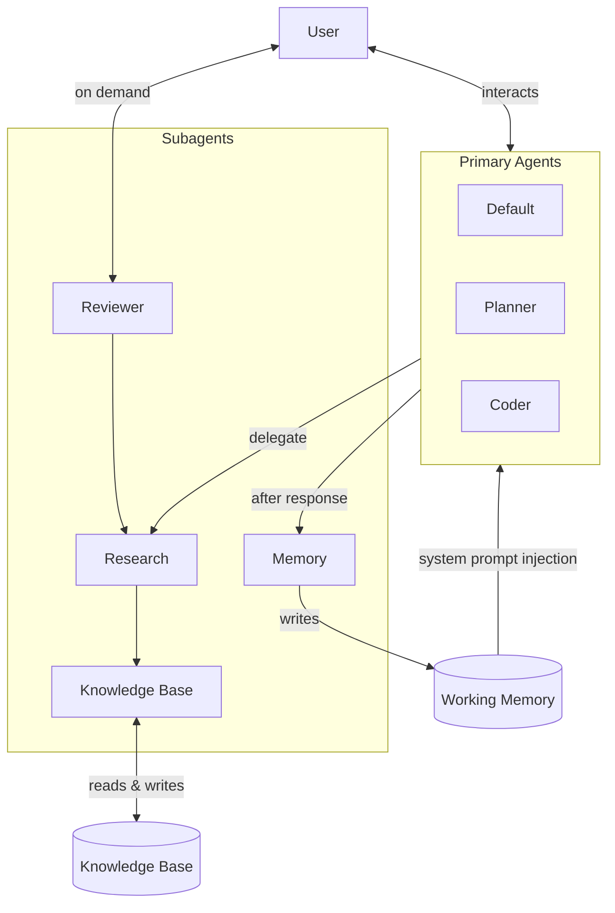

# vibe-ai-agent-harness

A multi-agent AI coding assistant harness with persistent memory and a self-updating knowledge base.

## Philosophy

AI sessions start cold. The goal of this harness is to make that a non-issue — context is persisted so you can start a new session at any time without re-establishing what you were doing or what the agent should know.

Agents are specialized and narrow. Each does one thing well — the UNIX philosophy applied to AI. Narrow scope means smaller context, cleaner instructions, and compatibility with smaller models. The system is designed so that even lightweight models can perform well in focused roles.

The system is model-agnostic. Models are the brain — swappable at any time without changing the logic. No vendor lock-in.

## System



## Agents

| Agent | Type | Role |
|---|---|---|
| Default | Primary | Main interaction — research, memory, general coding tasks |
| Planner | Primary | Creates structured plans before implementation begins |
| Coder | Primary | Executes plans or ad-hoc coding requests; writes tests, updates docs |
| Research | Subagent | Investigates topics; checks knowledge base before going external |
| Knowledge Base | Subagent | Reads and writes the zettelkasten knowledge base |
| Memory | Subagent | Formats content into concise, atomic working memory items |
| Reviewer | Subagent | Blunt code reviews focused on correctness, security, and architecture |

## Memory & Knowledge Base

The harness uses two persistence layers with different purposes.

**Working memory** is a short-term context store — a flat markdown file capped at 50 items. It holds recent decisions, preferences, and high-level outcomes. At the start of every session it is injected into the system prompt, giving the primary agent immediate context without any manual re-establishment. After each response, the primary agent calls `remember()` which triggers the memory agent to format the item and append it to the file. The oldest items are pruned when the cap is reached.

**The knowledge base** is a zettelkasten — a graph of atomic markdown notes linked to each other. It is the long-term source of truth. When an agent needs to learn something new, it researches it and writes it into the knowledge base. The knowledge base agent acts as the gatekeeper — all reads and writes go through it.

## Getting Started

1. Edit `config.ts` to set your paths and preferred model profile
2. Run `./install.sh` to render and install

```bash
./install.sh                                         # install with default profile
./install.sh --platform opencode --profile broke     # install with a different profile
./install.sh --dry-run                               # preview without writing
```
